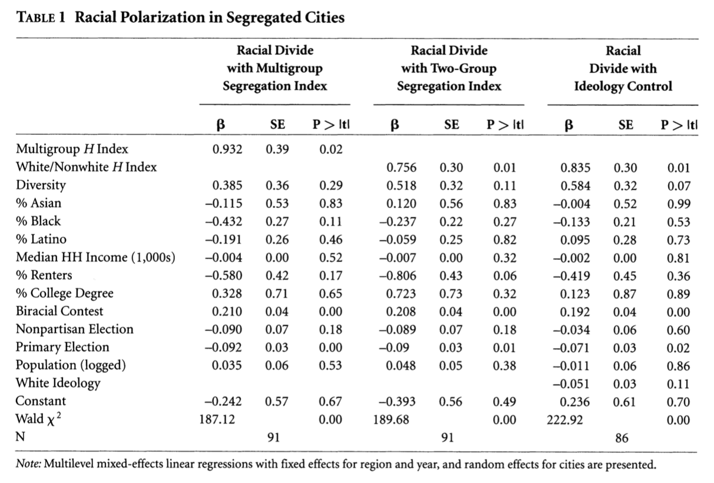

# Abstract

@trounstine_segregation_2016 suggests that high levels of residential segregation are associated with increased political polarization and decreased public spending. In this analysis, I was able to successfully replicate @trounstine_segregation_2016’s main results. I then attempted to better deal with the large amounts of missing data in the datasets used in the original analysis by multiply imputing missing values using the mice() package and then by re-running the original models using the multiply imputed datasets. My results suggest that segregation is associated with increased racial political polarization, although maybe not as strongly as Trounstine (2016) originally suggested. Furthermore, I find that Trounstine (2016)'s conclusion that increases in segregation are associated with decreases in public spending holds for large cities, but that diversity is a better explanatory factor for small cities. 

\newpage

```{r setup, include=FALSE}
knitr::opts_chunk$set(echo = TRUE, fig.align = "center")
knitr::write_bib(c("knitr", "stringr"), "bib.bib", width = 60)
library(haven)
library(stargazer)
library(tidyverse)
library(gtsummary)
library(knitr)
library(AER)
library(lme4)
library(margins)
library(lfe)
library(readxl)
library(mice)
library(VIM)
library(kableExtra)
library(huxtable)
```

```{r data_imports, include = FALSE}

set.seed(100)

# import both datasets

rp <- read_dta("racial_polarization_winners.dta")
fin_seg<- read_dta("fin_seg.dta")


```

```{r data_cleaning_rp, include = FALSE}

# create a factor for year for the rp dataset
rp$year.f <- as.factor(rp$year)

# apply the condition that winner == 1 as in the Stata code for the rp regressions

rp_1<- rp %>%
  filter(winner == 1) %>%
  mutate(medincinterp = medincinterp/1000)


```

# Introduction

There is a large degree of variation in public goods spending across local governments. As a result, many scholars have worked to determine what factors may lead to the underprovision of public goods spending. Research in the past has associated racial diversity or changes in levels of diversity with the under-provision of public goods [@baqir_public_1999; @hopkins_diversity_2009].However, @trounstine_segregation_2016 argues that it is racial segregation, not diversity in and of itself, that results in the under-provision of public goods. Trounstine’s analysis consists of two main parts. First, she uses election and demographic data from 25 of America’s largest cities between 1990 and 2010 to run a multilevel mixed-effects linear regression with fixed effects for region and year and with random effects for cities in order to show that polarization increases with segregation. Trounstine measures segregation with Theil's H index, which measures the degree to which the diversity of a neighborhood differs from the diversity of the entire city. The second main part of Trounstine’s analysis looks at the ability of the Theil’s H segregation index to explain a variety of types of public expenditures by city using a sample of 2,637 cities with 13,742 city-year observations. Using linear regressions with fixed effects for cities and robust standard errors clustered by city, Trounstine finds a significant, negative correlation between segregation and public goods spending that is robust to the inclusion of a variety of relevant controls and an alternative specification in which the number of waterways is used as an instrument for segregation. 

In this analysis, I first work to replicate the main results of @trounstine_segregation_2016 using R statistical software [@r]. The original data and Stata code made publically available by the author were downloaded via the Harvard Dataverse [@DVN/4LZXTY_2015]. I also make all of my code and analysis available on Github.^[ Link to my [Github repository](https://github.com/mburzillo/new_final_project) for this project.] I was successfully able to replicate the main results of @trounstine_segregation_2016 in R with the exception of some of the marginal analyses, which I was nevertheless able to replicate in Stata. 


```{r data_prep_imputations, include = FALSE}

# select the relevant rows from the rp dataset

rp_impute <- rp %>%
  select("winner", "medincinterp",
             "biggestsplit", "H_citytract_multi_i", "diversityinterp",
             "pctasianpopinterp", "pctblkpopinterp", "pctlatinopopinterp",
             "pctrentersinterp", "pctcollegegradinterp", "biracial", "nonpartisan",
             "primary", "logpop", "year", "south", "midwest", "west", "geo_id2",
             "H_citytract_NHW_i", "whiteideology_fill2") %>%
  filter(winner == 1) %>%
  mutate(medincinterp = medincinterp/1000,
         year.f = as.factor(year))

# apply the conditions in Stata regression to the fin_seg dataset

fin_imp <- fin_seg %>%
  filter(totaltractsf > 1 | is.na(totaltractsf), dgepercap_cpi != 0) %>%
  mutate(medinc_cpi = medinc_cpi/1000)

# select the relevant variables to be imputed

fin_imp <- fin_imp %>%
  select(H_citytract_NHW_i, dgepercap_cpi, diversityinterp, pctblkpopinterp,
         pctasianpopinterp,pctlatinopopinterp, medinc_cpi, pctlocalgovworker_100,
         pctrentersinterp, pctover65, pctcollegegradinterp, logpop, geo_id2,
         chng5pctblk, chng5pctlatino, chng5pctasian, ideology_fill)

```


```{r obs_in_original_fin_and_cities, include = FALSE}
# basic filter for table for all regressions

# xtreg dgepercap_cpi H_citytract_NHW_i diversityinterp pctblkpopinterp
# pctasianpopinterp pctlatinopopinterp medinc_cpi pctlocalgovworker_100
# pctrentersinterp pctover65 pctcollegegradinterp logpop if totaltracts>1 &
# dgepercap_cpi~=0,fe vce(cluster geo_id2)

fin <-fin_seg %>%
  filter(totaltractsf >1 | is.na(totaltractsf)) %>%
  filter(!(is.na(dgepercap_cpi)), !(is.na(H_citytract_NHW_i)), !(is.na(diversityinterp)),
         !(is.na(pctblkpopinterp)), !(is.na(pctasianpopinterp)), !(is.na(pctlatinopopinterp)),
         !(is.na(medinc_cpi)), !(is.na(pctlocalgovworker_100)), !(is.na(pctrentersinterp)),
         !(is.na(pctover65)), !(is.na(pctcollegegradinterp)), !(is.na(logpop)))

# create dge variable used in regression

fin_dge <-fin %>% filter(dgepercap_cpi != 0)

# cities in original Trounstine

cities_trounstine_fp <- fin_dge %>%
  select(geo_id2) %>%
  unique() %>%
  pull()

# When we subset for only the cities in the original analysis, this about doubles the sample size still...

fin_imp_cities <- fin_imp %>%
  filter(geo_id2 %in% cities_trounstine_fp)


```


```{r obs_count, include = FALSE}

# calculate number of original observations

obs_fin_seg <- nrow(fin_imp)
obs_rp <- nrow(rp_impute)

```


One concern with the original analysis in @trounstine_segregation_2016 is the large amount of missing data, which substantially constrains the sample size used in the regression analysis. For example, the regression analysis in the main specification using the the original racial polarization dataset exludes %`r round((obs_rp - 91)/obs_rp, 2)` of the observations, and the regression analysis in the main specification using the original financial segregation data excludes %`r round((obs_fin_seg - 13742)/ obs_fin_seg, 2)` of observations from the original dataset. As an extension of @trounstine_segregation_2016, I impute missing values in the original data using the mice package in R, which generates multivariate imputations using chained equations [@mice]. Then, I use the multiply imputed datasets to re-estimate the original models, pooling the results to generate final pooled regression coefficients and parameters. 

Comparing the results of the original regressions and those done with the imputed data yields similar big picture results in terms of the direction of the signs on the coefficients on the segregation indices. Like in @trounstine_segregation_2016, I find that segregation is positively associated with political polarization and negatively associated with spending on public goods. However, the magnitude of the effects in most specifications has diminished and most results become statistically insignificant. While these findings do not necessarily challenge the results of @trounstine_segregation_2016, they do call into question the relative importance of segregation in determining public goods spending and political polarization and suggest that the results of @trounstine_segregation_2016 may not be quite as robust as once thought. 


# Literature Review

Despite some progress made towards racial equity in the U.S. on other fronts, residential racial segregation continues to be prevasive and deeply entrenched in society [@fischer_distinguishing_2004; @oliver_paradoxes_2010; @massey_american_1993]. Research suggests that this kind of segregation has political consequences, as political cleavages in segregated cities tend to have racial as well as spatial dimensions [@massey_american_1993]. Neighborhoods are often important actors within local politics because local governments provide many functions that are allocational in nature and concern geographical space [@trounstine_segregation_2016]. Thus, when neighborhoods are divided on racial lines as well as spacial lines, it is natural to expect higher degrees of racial polarization as a result. 

Studying residential segregation is difficult because its effects tend to differ by geographic level. On the neighborhood level, the kind of geographic racial isolation brought on by residential segregation has been associated with racial intolerance, resentment, and competition between racial groups [@oliver_paradoxes_2010]. Living within segregated neighborhoods has also been associated with holding negative stereotypes and perceptions about out groups [@eric_oliver_intergroup_2003]. As a result, homogeneous neighborhoods have been associated with increased racial tension and political polarization in comparison to integrated, diverse neighborhoods. However, at the city or metropolitan level, the opposite seems to be true: when considering larger geographic areas, diversity and integration are correlated with racial tension, competition, prejudice, lower levels of cooperation, and lower spending on public goods [@oliver_paradoxes_2010; @baqir_public_1999; @hopkins_diversity_2009]. While these differences in the expected effect of segregation on the geographic level may seem confusing at first, they make sense as they suggest that the most severely segregated areas are those that are diverse overall, but have many homogeneous neighborhoods. Thus, while people of different races co-exist within a highly segregated city, they live separately within their own neighborhoods, which creates an environment ripe for racial tension [@trounstine_segregation_2016]. It is thus not simply the level of diversity or integration that matters for racial harmony and cooperation, but their patterns within a larger geographic framework [@trounstine_segregation_2016; @oliver_paradoxes_2010; @bharathi_public_2018]. 

Political polarization along racial lines may lead to decreased public spending and goods provision because groups may have different preferences, which can make compromise hard, and because groups may preceive a disutility in out-groups receiving public goods expenditure [@baqir_public_1999]. @einstein_divided_2012 found evidence that racial segregation predicts large political divisions at the metropolitan level and that these divisions can create a lack of willingness to compromise and collaborate on local policy problems. @trounstine_segregation_2016 finds similar results at the city level: that residential racial segregation is associated with both increased political division and decreased public spending. Thus, these authors suggest that it is the combination of homogenous neighborhoods within a much larger, diverse geographic area that leads to increased political polarization and reduced public goods spending in local governments. 

More recently, some scholars have called this hypothesis and its importance into question. For example, @lee_ethnic_2018 finds evidence that larger inequalities within the political system favoring socially powerful groups, not local diversity patterns leading to decreased cooperation, may be a better explanation of failures in public goods provision in diverse areas. Others suggest that additional factors, such as income segregation, may be important confounding factors in public goods provision. @an_its_2018, for example, suggests that the more closely related income inequality is to racial inequality, the less investment is made in public goods, and that this interaction was a better predictor of public goods spending patterns than measures of diversity. There is, in fact, a variety of evidence suggesting that it is meaningful to consider the effects of income inequaltiy and diversity and segregation jointly [@an_its_2018; @massey_american_1993]. Given the active debate in the literature over the relaitonships between diversity, segregation, public spending, and other factors, it is increasingly important to re-examine previously reported findings as a means of robustness checks. 


# Replication

I was able to successfully replicate all of the main results from Trounstine (2016). All regressions and tables were fully replicated in R. As an example, in table X, I replicate Table 1 from page 713 of @trounstine_segregation_2016, which is also included as Figure 1 for comparison. However, I was unable to successfully replicate Trounstine (2016)’s marginal effects analyses and margins plots using R. There does not yet appear to be a built-in R function to calculate marginal or predicted effects or to generate margins plots from the complicated multi-level models employed in the original paper, and creating such a function was outside of the scope of this analysis. Nevertheless, these results were successfully replicated in Stata. 

There was one interesting outcome from my attempt to replicate the original Stata code in R. Due to the differences in R and Stata in dealing with missing values, the results of my first replication of analyses using the financial segregation dataset were slightly different than the results in Stata from the original paper. In order to exclude cities from her analysis with only one census tract, Trounstine conditions her regressions in Stata such that the value for the number of census tracts is greater than one. In Stata, this does not remove missing values, whereas in R, it does. Since this variable is used only as a conditional filter and not as a regression variable (and thus, the observations with missing values for number of census tracts are not dropped), Trounstine’s analysis includes 14 cities and 58 observations with missing values for census tracts in addition to cities with two or more census tracts. This is a potential oversight on the part of the author, and I would suggest also dropping observations with missing census tract data, or else imputing them given that the aim of her condition was to exclude cities without a sufficient number of census tracts. Nevertheless, dropping these values did not have much of an effect on the subsequent results, likely because they represent a small proportion of the overall sample. 


# Extension


One concern with the original analysis in @trounstine_segregation_2016 is the large amount of missing data values in her original datasets. Because both R and Stata drop any observations with missing values for any of the variables used in a regression, this can exlcude a large portion of the data from the analysis and potentially bias the results if the data is not missing completely at random. A large amount of data is missing in both of the main datasets used in the analyses of @trounstine_segregation_2016. The main model specification using the racial polarization dataset exludes `r (obs_rp - 91)` of the original  `r obs_rp` observations, or  %`r round(100*(obs_rp - 91)/obs_rp,2)` of the data. Additionally, the main model specification using the financial segregation data set excludes `r round(obs_fin_seg - 13742,2)` of the original `r obs_fin_seg` observations, or %`r round(100*(obs_fin_seg - 13742)/ obs_fin_seg,2)` of observations from the original dataset. 

In an attempt to better deal with the problem of missing data in @trounstine_segregation_2016, I impute missing values in the original data using the mice package in R, which generates multivariate imputations using chained equations [@mice]. While there are a variety of different imputation methods that could have been employed, multiple imputation (such as the multiple multivariate imputations generated by mice) is desirable because instead of inputting a single value such as the mean for missing values, it instead uses the distribution of the available data to estimate multiple potential values for the missing data. As a result, multiple imputation helps to account for the uncertainty inherent in the imputation process and allows for the calculation of standard errors around estimators. Thus, multiple imputation allows the researcher to more accurately assess the of uncertainty in the analysis in general. 

Before performing the multiple imputations on the datasets, I first examined the missing data for patterns. To better understand any potential patterns in missing data, I plotted the pattern of missingness and created a histogram showing the frequency of missing values for those variables with missing values in figure X1 for the racial polarization data and figure X2 for the financial segregation data. Looking at figure X1, the histogram shows that the variables for the largest vote split along racial lines and the variable indicating whether or not the election had candidates of more than one race had by far the largest percentages of missing data, missing %`r round(sum(is.na(rp_impute$biggestsplit))/nrow(rp_impute)*100,2)` and  %`r round(sum(is.na(rp_impute$biracial))/nrow(rp_impute)*100,2)`, respectively. It is important to note that the variable for the largest vote split along racial lines is the dependent variable in the regresison analysis, and thus, we are missing a large percentage of this key variable. From the plot on the right, we can see that approximately 42% of observations are complete (have no missing values). There seem to be a correspondence between missing a value for the largest vote split and missing a value for the biracial election indicator. There also seem to be about 2% of values for wich most of the variables are missing. However, most observations are not missing more than 2-3 values. 


```{r rp_aggr_plot, echo = FALSE, fig.cap = "This plot examines the pattern of missing data in the the original racial polarization dataset from Trounstine (2016). The plot on the left shows the percentage of missing data for each variable with missing data and reveals that the variables that are missing by far the most data are the largest vote split along racial lines (biggestsplit) and the variable indicating whether or not the election had candidates of more than one race (biracial). The plot on the right shows the pattern of missingness among the variables. We can see that approximately 42\\% of observations are complete (have no missing values). There seems to be a correspondence between missing a value for biggest split and missing biracial. There also seem to be about 2\\% of values for which most of the variables are missing. However, most observations are not missing more than 2-3 values.", fig.width= 6, fig.height = 5, warning = F, fig.pos="H"}

# select only the missing values

rp_aggr <- rp_impute %>%
   select("biggestsplit", "biracial", "whiteideology_fill2", "medincinterp",
            "diversityinterp",
             "pctasianpopinterp", "pctblkpopinterp", "pctlatinopopinterp",
             "pctrentersinterp", "pctcollegegradinterp", "nonpartisan",
               "south", "midwest", "west") %>%
  rename("Racial Divide" = biggestsplit, "Biracial Contest" = biracial, 
         "White Ideology" = whiteideology_fill2, "Median HH Income" = medincinterp,
         "Diversity" = diversityinterp, "% Asian" = pctasianpopinterp, 
         "% Black" = pctblkpopinterp, "% Latino" = pctlatinopopinterp,
         "% Renters" = pctrentersinterp, "% College Grads" = pctcollegegradinterp,
         "Nonpartisan Elect." = nonpartisan, "South" = south, "Midwest" = midwest,
         "West" = "west")


# create an aggr plot for the missing values
par(font = 1)
aggr(rp_aggr, bars = TRUE,  col=c('navyblue','red'), numbers=TRUE, cex.axis=.5, gap=1, ylab=c("Proporiton of Missing Values","Combinations"))
title(main = "Patterns of Missingness in the Financial Segregation Data",
      sub = "", line = 3, oma = c(1,3,5,1), cex.axis = .5, font.main = 1, font.axis = 1, cex.main = 1, cex.lab = .75)

```


In figure X2, we can similarly observe the trends for the financial segregation dataset. In this dataset, there is a very high proportion of missing variables for a number of variables. For example, there are `r sum(is.na(fin_imp$H_citytract_NHW_i))` missing values for the segregation index, which is the main independent variable, or %`r round(sum(is.na(fin_imp$H_citytract_NHW_i))/nrow(fin_imp)*100,2)` of the data. In this dataset, there are also many more observations for which values are missing for multiple variables in comparison to the racial polarization dataset. In total, a mere %`r .0058*100` of observations are complete for all variables included in the main specification for the financial segregaion dataset. 


```{r fin_aggr_plot, echo = FALSE, fig.cap = "This plot examines the pattern of missing data in the the original financial segregation dataset from Trounstine (2016). The plot on the left shows the percentage of missing data for each variable with missing data and reveals that a large number of variables are missing the vast majority of data. The plot on the right shows the pattern of missingness among the variables. We can see that only .58\\% of observations are complete (have no missing values), and a large majority of the observations are missing data for many variables.", fig.width= 7, fig.height = 5, fig.pos="H"}

# select all variables with missing values for the aggr plot

fin_imp_aggr <- fin_imp %>%
  select(ideology_fill, H_citytract_NHW_i, chng5pctblk, chng5pctlatino, 
         chng5pctasian, diversityinterp, pctblkpopinterp, pctasianpopinterp,
         pctlatinopopinterp, medinc_cpi, pctlocalgovworker_100, pctrentersinterp,
         pctover65, pctcollegegradinterp) %>%
    rename("White Ideology" = ideology_fill, "White/Non-White H Index" = H_citytract_NHW_i,
           "5Y Change % Black" = chng5pctblk, "5Y Change % Latino" = chng5pctlatino, 
           "5Y Change % Asian" = chng5pctasian, "Diversity" = diversityinterp, 
           "% Asian" = pctasianpopinterp, "% Black" = pctblkpopinterp, 
           "% Latino" = pctlatinopopinterp, "Median HH Income" = medinc_cpi,
           "% Local Gov. Worker" = pctlocalgovworker_100, "% Renters" = pctrentersinterp, 
           "% College Grads" = pctcollegegradinterp, "% 65+" = pctover65)
           

new_try <- head(fin_imp_aggr, 20)

# create the aggr plot

aggr(fin_imp_aggr, plot = TRUE, bars = TRUE, col=c('navyblue','red'), numbers= FALSE, cex.axis=.4, gap=2, ylab=c("Proporiton of Missing Values","Combinations"))
title(main = "Patterns of Missingness in the Financial Segregation Data",
      sub = "", font.main = 1, font.axis = 1, cex.main = 1, line = 3,  oma = c(1,3,5,1), font.main = 1, font.axis = 1)
# this plot tells us that only .58% of the data are complete (not missing anything)


```

Because neither dataset seems to exhibit any clear patterns in the missing, data, it makes sense to proceed with the imputation. For the racial polarization dataset, I performed multiple imputations with 20 iterations using mice, while for the financial segregation dataset, I performed only 5 iterations due to the large size of the dataset and computing limitaitons. A non-stochastic imputation method, Classification and Regression Trees (CART), was used instead of the default for the imputation for both datasets because of an error with matrix inversion caused by the data that prevented the use of the default method, predictive mean matching. For the racial polarization dataset, I included all of the variables used in the analysis associated with the dataset and was able to impute all missing values. For the financial segregation dataset, however, I only imputed values for the main independent variable, the segregation index, and a few other variables, although all variables used in the analysis were included in the data subset input into the mice function. More of the data could not be imputed from the financial segregation dataset due to computing and time constraints for this project given the dataset's large size and high proportion of missing values. 

```{r rp_imputation, include = FALSE}

# Perform multiple imputations using the cart method. Because of the time it
# takes to run this function, I turned the results into a dataset to load in
# instead of re-running everytime.

rp_impute_labels <- rp_impute 

rp_impute_labels$biggestsplit <- "Racial Divide"
rp_impute_labels$medincinterp <- "Median HH Income"

#c("Racial Divide" = biggestsplit, "Biracial Contest" = biracial, "White Ideology" = whiteideology_fill2, "Median HH Income" = medincinterp, "Diversity" = diversityinterp, "% Asian" = pctasianpopinterp,  "% Black" = pctblkpopinterp, "% Latino" = pctlatinopopinterp,"% Renters" = pctrentersinterp, "% College Grads" = pctcollegegradinterp, "Nonpartisan Elect." = nonpartisan, "South" = south, "Midwest" = midwest,"West" = "west")


max_it = 20

imp_1_rp <- mice(rp_impute, method = "cart", maxit = 20)


```

```{r fp_imputations_original, include = FALSE, eval = FALSE}

# perform multiple imputations. We have the same issue here with the default method as with the previous dataset so we use CART. Additionally, because of the extremely large size of this dataset, we choose to only impute the variable H_citytract_NHW_i, as it is the most frequently missing variable and also out main independent variable. Just imputing this allows us to include way more observations in the regression than the original data despite the still large number of NAs overall. One concern here would be that if there was some reason that this variable was missing rather than other variables that only imputing this variable could lead to some bias in the results.  

# generate a blank run to get the method matrix

ini <- mice(fin_imp, maxit = 0, print = FALSE)

# view the current method settings

meth <- ini$method


# change the method variables for all variables except H_citytract_NHW_i to ""
# so that their missing values aren't imputed

meth[c("dgepercap_cpi", "diversityinterp", "pctblkpopinterp", "pctasianpopinterp",
         "pctlatinopopinterp", "medinc_cpi", "pctlocalgovworker_100", "pctrentersinterp",
         "pctover65", "pctcollegegradinterp", "logpop", "geo_id2")]=""


# change the default method to "cart" so that we don't get the error

meth[c("H_citytract_NHW_i", "chng5pctblk", 
       "chng5pctlatino", "chng5pctasian", "ideology_fill")] = "cart"

# perform the multiple imputations with 5 iterations

imp_fs <- mice(fin_imp, method = meth, maxit = 1)

# now there are many fewer missing variables!!!

miss_var_summary(complete(imp_fs))

miss_var_summary(fin_imp)

282334 - 222957

```

## make sure to talk about the fact that still a large number of values missing for the imputed variables here

Before examining the results of Trounstine's model using the multiply imputed data, I first ran some diagnostic tests on the imputation results to make sure that everything ran as expected. First, I checked the convergence of the algorithm used within mice() by plotting the trace lines as a function of the number of iterations for each of the variables. Then, I visually inspected the distributions of the imputed data in comparison to the original data with density and strip plots. All of these checks suggested that the imputed values were within a plausible range of the data and that their distribution fit the underlying distribution of the data relatively well. The only cases in which there was some cause for concern were for some of the variables with very few missing values in the racial polarization dataset (such as the indicators for region). However, this is more or less to be expected given the small number of imputations performed in these cases. Thus, and especially because there are so few of these values missing in the actual datasets, this was not a major concern. See figures X and X1 to see the density plots of the imputed values overlayed on the density plots of the original variables. The code to generate the rest of the plots and results of the diagnostic tests discussed here are presented in the Appendix. 


```{r rp_densityplot, echo = FALSE}

my.settings <- list(
  par.main.text = list(font = 1, cex = 1)
)

densityplot(imp_1_rp, main = "Density Plots of Imputed and Original Data by Variable\nin the Racial Polarization Dataset",
      par.settings = my.settings,
      par.strip.text = list(cex = .7))


```

```{r fs_densityplot, echo = FALSE, eval = FALSE}

densityplot(imp_fs)
densityplot(x = imp_fs , data = ~ H_citytract_NHW_i + chng5pctblk + 
       chng5pctlatino + chng5pctasian + ideology_fill)

```

Given the promising results of the diagnostic checks, I next proceeded to re-estimate the original model using the multiply imputed datasets, pooling the results to produce final pooled regression coefficients and parameters. The results for the analyses using the racial polarization dataset are presented in tables X1-X3. 


```{r rp_imputations, include = FALSE}

# Now that we have imputed the missing data, we can re-run the analyses from the
# original paper to see how and if this changes the analysis. We can use the
# with() function from the mice package to fit each of the imputed datasets to
# the model and then pool the results afterwards.

# regression 1: fit multiple imputed datasets

fit_imp_1_rp <- with(imp_1_rp, lmer(formula = biggestsplit ~ H_citytract_multi_i + diversityinterp + pctasianpopinterp + pctblkpopinterp + pctlatinopopinterp + medincinterp + pctrentersinterp +  pctcollegegradinterp + biracial + nonpartisan + primary + logpop + year.f + south + midwest + west + (1 | geo_id2), REML=FALSE))

# pool and summarize the analyses

pool_imp_1_rp <- pool(fit_imp_1_rp)
imp_1_rp_sum <- summary(pool_imp_1_rp)

## regression 2 Table 1: fit multiple imputed datasets

#formula = biggestsplit ~ H_citytract_NHW_i + diversityinterp + pctasianpopinterp + pctblkpopinterp + pctlatinopopinterp + medincinterp + pctrentersinterp +  pctcollegegradinterp + biracial + nonpartisan + primary + logpop + year.f + south + midwest + west + (1 | geo_id2)

fit_imp_2_rp <- with(imp_1_rp, lmer(biggestsplit ~ H_citytract_NHW_i + diversityinterp + pctasianpopinterp + pctblkpopinterp + pctlatinopopinterp + medincinterp + pctrentersinterp +  pctcollegegradinterp + biracial + nonpartisan + primary + logpop + year.f + south + midwest + west + (1 | geo_id2), REML=FALSE))
                     
# pool and summarize the analyses

pool_imp_2_rp <- pool(fit_imp_2_rp)
imp_2_rp_sum <- summary(pool_imp_2_rp)


## regression 3 Table 1 with new data

#formula = biggestsplit ~ H_citytract_NHW_i + diversityinterp + pctasianpopinterp + pctblkpopinterp + pctlatinopopinterp + medincinterp + pctrentersinterp +  pctcollegegradinterp + biracial + nonpartisan + primary + logpop + whiteideology_fill2 + year.f + south + midwest + west + (1 | geo_id2)

fit_imp_3_rp <- with(imp_1_rp, lmer(biggestsplit ~ H_citytract_NHW_i + diversityinterp + pctasianpopinterp + pctblkpopinterp + pctlatinopopinterp + medincinterp + pctrentersinterp +  pctcollegegradinterp + biracial + nonpartisan + primary + logpop + whiteideology_fill2 + year.f + south + midwest + west + (1 | geo_id2), REML=FALSE))

# pool and summarize the analyses

pool_imp_3_rp <- pool(fit_imp_3_rp)
imp_3_rp_sum <- summary(pool_imp_3_rp)

```

The results of the model with the new dataset are slightly different in comparison to the original results from Trounstine (2016). With the imputed data, we now have a total of `r nrow(complete(rp_impute))` observations in our model as compared to the original model, which had only 91 observations. Interestingly, while the sign of the coefficient on the main variable of interest, the Theil's H segregation index, is the same and the standard error has decreased slightly, the result has become statisically insignificant and the 95% confidence interval contains zero. Thus while these results still suggest that segregation may be associated with increased political polarization, they confer a lesser degree of certainty than Trounstine's original analysis. The coefficients for % Black population, % Latino population, and median household income have also switched signs, and all coefficients except the indicator for a biracial election are also statistically insignificant, as was the case in the original analysis. The coefficient on the indicator for a primary election, has also changed from being significant in the original analysis to insignificant here. In general, the standard errors on the coefficients have decreased slightly. 

```{r results_printing_rp_impute_regressions_1, results = "asis", echo=FALSE}

# print results of 1st regression

imp_1_rp_sum_table <- as.data.frame(imp_1_rp_sum) %>% 
  select(term, estimate, std.error, p.value) %>%
  head(13) %>%
  mutate()

imp_1_rp_sum_table_vars <- tibble(
  Variable = c("Intercept", "Multigroup Seg. Index", "Diversity", "% Asian", "% Black", "% Latino",
               "Median Income (1000s)", "% Renters", "% College Grads", "Biracial Elec.", "Nonpartisan Elec.", "Primary Elec.", "Pop (logged)"),
  Estimate = round(imp_1_rp_sum_table$estimate, 3),
  `Std. Error` = round(imp_1_rp_sum_table$std.error,3),
  `P-Value` = round(imp_1_rp_sum_table$p.value, 3)
  )

kable(imp_1_rp_sum_table_vars, "latex", caption = "\\textbf{Racial Polarization in Segregated Cities: Racial Divide with Multigroup Segregation Index}", booktabs = T) %>%
  row_spec(0, bold = TRUE) %>%
  footnote(general = c("This table shows the results of Trounstine's first model for the effect of segregation on political polarization",
  "(racial vote divide) using the multi-group Theil's H segregation Index using the new, multiply imputed datasets.",
  "The sign of the coefficient on the main variable of interest, the segregation index, is the same, but the",
  "result has become statisically insignificant with the 95% confidence interval containing zero. Thus",
  "while these results still suggest that segregation may be associated with increased political polarization,",
  "they confer a lesser degree of certainty than Trounstine's original analysis. The coefficients for %",
  "Black population, % Latino population, and median household income have also switched signs. The coefficient",
  "on the indicator for a primary election, has also changed from being significant in the original analysis",
  "to insignificant here. In general, the standard errors on the coefficients have decreased slightly."),
           general_title = "Table 1:")%>%
  kable_styling(full_width = TRUE)

```

In the second regression, the results are similar. The main coefficient on segregation index has decreased in magnitude, although in these specifications, it remains statistically significant. The other coefficients except for the biracial indicator are insignificant, and the coefficients on percent Black, percent Latino, and median household income have all switched signs.

```{r results_printing_rp_impute_regressions_2, results = "asis", echo=FALSE}

# print results of 2nd regression

imp_2_rp_sum_table <- as.data.frame(imp_2_rp_sum) %>% 
  select(term, estimate, std.error, p.value) %>%
  head(13)

imp_2_rp_sum_table_vars <- tibble(
  Variable = c("Intercept", "White/Nonwhite Seg. Index", "Diversity", "% Asian", "% Black", "% Latino",
               "Median Income (1000s)", "% Renters", "% College Grads", "Biracial Elec.", "Nonpartisan Elec.", "Primary Elec.", "Pop (logged)"),
  Estimate = round(imp_2_rp_sum_table$estimate, 3),
  `Std. Error` = round(imp_2_rp_sum_table$std.error,3),
  `P-Value` = round(imp_2_rp_sum_table$p.value, 3)
  )

kable(imp_2_rp_sum_table_vars, "latex", caption = "\\textbf{Racial Polarization in Segregated Cities: Racial Divide with Two-Group Segregation Index}", booktabs = T) %>%
  row_spec(0, bold = TRUE) %>%
  footnote(general = c("This table shows the results of Trounstine's second model for the effect of segregation on political polarization",
  "(racial vote divide) using the two-group Theil's H segregation Index using the new, multiply imputed datasets.", 
  "Compared to Trounstine's original results, the main coefficient on segregation index has decreased in magnitude",
  "although, it remains statistically significant. The other coefficients except for the biracial indicator are",
  "insignificant, and the coefficients on percent Black, percent Latino, and Median Income have switched signs.",
  "Standard errors have also reduced slightly in these specifications compared to the original analysis in",
  "Trounstine (2016)."),
           general_title = "Table 2:") %>%
  kable_styling(full_width = TRUE)

```

In the third regression, like in the second, the main coefficient on segregation index has decreased in magnitude but remains significant. The other coefficients except for the biracial indicator are insignificant, and the coefficients on percent Black, percent Asian, median income, and logged population have switched signs. In all three of the specifications, tandard errors reduced slightly using the larger, multiply imputed datasets compared to the original analysis with the original data in @trounstine_segregation_2016. 

```{r results_printing_rp_impute_regressions_3, results = "asis", echo=FALSE}

# print results of 3rd regression

imp_3_rp_sum_table <- as.data.frame(imp_3_rp_sum) %>% 
  select(term, estimate, std.error, p.value) %>%
  head(14)

imp_3_rp_sum_table_vars <- tibble(
  Variable = c("Intercept", "White/Nonwhite Seg. Index", "Diversity", "% Asian", "% Black", "% Latino",
               "Median Income (1000s)", "% Renters", "% College Grads", "Biracial Elec.", "Nonpartisan Elec.", "Primary Elec.", "Pop (logged)", "White Ideology"),
  Estimate = round(imp_3_rp_sum_table$estimate, 3),
  `Std. Error` = round(imp_3_rp_sum_table$std.error,3),
  `P-Value` = round(imp_3_rp_sum_table$p.value, 3)
  )

kable(imp_3_rp_sum_table_vars, "latex", caption = "\\textbf{Racial Polarization in Segregated Cities: Racial Divide with Ideology Control}", booktabs = T) %>%
  row_spec(0, bold = TRUE) %>%
  footnote(general = c("This table shows the results of Trounstine's third model for the effect of segregation on political polarization",
  "(racial vote divide) using the two-group Theil's H segregation Index and including controls for ideology",
  "using the new, multiply imputed datasets. Compared to Trounstine's original results, the main coefficient on segregation index has decreased in",
  "magnitude although, it remains statistically significant. The other coefficients except for the biracial",
  "indicator are insignificant, and the coefficients on percent Asian and Black have switched signs.",
  "Standard errors have also reduced slightly in these specifications compared to the original analysis",
  "in Trounstine (2016)."),
           general_title = "Table 3:") %>%
  kable_styling(full_width = TRUE)

```


\newpage

# Appendix

```{r  include = FALSE}

## regression 1 Table 1

# perform a multi-level mixed-effects linear regression of biggest split on the multi-group H index with controls for Herfindahl Diversity Index, % Asian interpolated, % Black interpolated, % Latino interpolated, median household income interpolated, % renters interpolated, percent college grads interpolated, a dummy indicating if there were biracial candidates in the election, a dummy  indicating if the election was nonpartisan, an indicator if the election was a primary, and the log population. The regression also includes fixed effects for year and region and random effects for cities (geo_id2). Diversity is  included because of the claim that more diverse populations will have more heterogeneous political preferences. The other fixed effect control variables are included because they are known to be potentially correlated with segregation. winner == 1 requires that there was a winner in the election.

# regression specification. Apply REML = FALSE. The default for lmer() in R is
# to optimize the restricted (residual) maximum likelihood (REML) whereas in
# xtmixed in Stata the default is to optimize the log likelihood (which you can
# do in lmer() in R by setting REML = FALSE), so this will match the STATA code

m1 <- lmer(biggestsplit ~ H_citytract_multi_i + diversityinterp + pctasianpopinterp + pctblkpopinterp + pctlatinopopinterp + medincinterp + pctrentersinterp +  pctcollegegradinterp + biracial + nonpartisan + primary + logpop + year.f + south + midwest + west + (1 | geo_id2), data = rp_1, REML=FALSE)

## regression 2 Table 1

# Perform the same regression as for Column 1 above but this time regress on the two-group calculation of Theil's H interpolated. It is unclear where the "diversity" variable is coming from, as the only variable related to diversity in the specificed dataset is diversityinterp. This is a problem that will need to be resolved. Essentially, this regression just tests an alternate specification to the first in which the segregation index in defined in terms of two-groups rather than multiple.

m2 <- lmer(biggestsplit ~ H_citytract_NHW_i + diversityinterp + pctasianpopinterp + pctblkpopinterp + pctlatinopopinterp + medincinterp + pctrentersinterp +  pctcollegegradinterp + biracial + nonpartisan + primary + logpop + year.f + south + midwest + west + (1 | geo_id2), data = rp_1, REML=FALSE)

# perform the same regression as for column 2, but now add in a measure of
# average white political ideology. The point of this is to control for ideology
# so that the author can separate any effects of segregation from any potential
# effects of white political ideology. This is important because it is possible
# that segregation is just a proxy for white conservatism and thus failure to
# include this variable could lead to ommitted variable bias.


m3 <- lmer(biggestsplit ~ H_citytract_NHW_i + diversityinterp + pctasianpopinterp + pctblkpopinterp + pctlatinopopinterp + medincinterp + pctrentersinterp +  pctcollegegradinterp + biracial + nonpartisan + primary + logpop + whiteideology_fill2 + year.f + south + midwest + west + (1 | geo_id2), data = rp_1, REML=FALSE)

```

```{r results="asis", echo = FALSE}

# create a stargazer table of the results

t1 <- stargazer(m1, m2, m3, omit = c("year", "south", "midwest", "west"),
                header = FALSE,
                style = "apsr",
                title = "\\textbf{Racial Polarization in Segregated Cities}",
                single.row = FALSE,
                no.space = F,
                covariate.labels = c("Multigroup H Index", "White/Nonwhite H Index", "Diversity", "Percent Asian", "Percent Black", "Percent Latino", "Medain HH Income (1000s)", "Percent Renters", "Percent College Degree", "Biracial Contest", "Nonpartisan Election", "Primary Election", "Population (logged)", "White Ideology", "Constant"),
                dep.var.labels = c("\\textbf{\\underline{Racial Divide with:    }}"),
                column.labels = c("Multigroup H Index", "White/Nonwhite H Index", "Ideology Controls"),
                notes = c("Table A1: This table displays the results of the replication effort of the analyses conducted in Trounstine (2016)", 
                          "using the racial polarization dataset. The replication code can be found on my personal Github repository, which is",
                          " linked in the introduction. The original table is displayed for comparison as Figure 3."),
                table.placement = "H",
                notes.align = "l",
                font.size = "small")


```





```{r felm, include = FALSE}

# Main Analysis 2

## regression 1 Table 2

# The following is a fixed effects model regression with clustering around
# geo_id2. It mandates that total census tracts in the city is greater than 1,
# which we want because our measure of evenness of racial spread is constant for
# cities with only one tract by our definition (which requires comparing tracts
# within cities). It also mandates that Direct General Expenditures (DGE) per
# capita, CPI adjusted is not equal to 0, which would be problematic and
# indicate a potential data error. This regression regresses the DGE per capita
# on the the two-group calculation of  Theil's H interpolated. Controls are
# included for diversity and the % populations of Blacks, Asians, and Latinos to
# help identify whether it is actually diversity that drives down spending.These
# demographic controls also help to account for the fact that whites and
# minorities tend to perfer different levels of government spending in general.
# This will help isolate the effects of segregation v. other forms of diversity
# on public spending. Other controls for Median household income, CPI adjusted,
# percent over 65, percent college grads, percent local government workers, log
# population help control for additional factors related to segregation and
# expenditure. Controls for percent renters interpolated and Median household
# income also help to control for the general wealth of cities, which could be a
# potential driver of public spending. Fixed effects for cities are also
# included  so that the author can examine the effect of segregation in the same
# city over  time, which also helps control for many other factors not otherwise
# taken into account (such as city age)

# apply the conditions in Stata regression

fin_seg_sub <- fin_seg %>%
  filter(totaltractsf > 1 | is.na(totaltractsf), dgepercap_cpi != 0) %>%
  mutate(medinc_cpi = medinc_cpi/1000)


# felm(y~x | factor(fe1) + factor(fe2) | 0 | clustervar)

felm1 <- felm(dgepercap_cpi ~ H_citytract_NHW_i + diversityinterp + pctblkpopinterp + pctasianpopinterp + pctlatinopopinterp + medinc_cpi + pctlocalgovworker_100 + pctrentersinterp + pctover65 + pctcollegegradinterp + logpop | factor(geo_id2) |0| geo_id2, data = fin_seg_sub)

## regression 2 Table 2

# This regression is the same as above except instead of using diversity, a new
# control is added for the five year changes in racial group shares. The goal
# here is to see whether or not changes in diversity are a driving factor
# (rather than absolute levels of diversity).


felm2 <- felm(dgepercap_cpi ~ H_citytract_NHW_i + pctblkpopinterp + pctasianpopinterp + pctlatinopopinterp + chng5pctblk + chng5pctlatino + chng5pctasian+ medinc_cpi + pctlocalgovworker_100 + pctrentersinterp + pctover65 + pctcollegegradinterp + logpop | factor(geo_id2) |0| geo_id2, data = fin_seg_sub)

## Regression 3 Table 2

# Column 3

# As in column 3 of table 1, this regression simply adds in a control for  mean  ideology of city residents from General Social Survey (GSS) to control for the  possibility that ideology that segregated cities are more ideologically  conservative and that the conservative nature of segregated cities is what actually drives the effect.

felm3 <- felm(dgepercap_cpi ~ H_citytract_NHW_i + diversityinterp + pctblkpopinterp + pctasianpopinterp + pctlatinopopinterp + medinc_cpi + pctlocalgovworker_100 + pctrentersinterp + pctover65 + pctcollegegradinterp + logpop + ideology_fill | factor(geo_id2) |0| geo_id2, data = fin_seg_sub)


```

```{r main_fp_tables, results = "asis", echo = FALSE}

# create main table for table 3

table2 <- stargazer(felm1, felm2, felm3, omit = c("year", "south", "midwest", "west"), 
                    header = FALSE,
                    style = "apsr",
                    title = "\\textbf{Effect of Segregation on Overall per Capita City Expenditures}",
                    covariate.labels = c("White/Nonwhite H Index", "Diversity", "Percent Black", "Percent Asian", "Percent Latino", "Change Percent Black", "Change Percent Latino", "Change Percent Asian", "Medain HH Income (1000s)", "Percent Government Worker", "Percent Renters", "Percent 65+", "Percent College Degree", "Population (logged)", "White Ideology", "Constant"),
                    dep.var.labels = c("\\textbf{\\underline{Direct General Expenditure Per Capita}}"),
                    column.labels = c("Main Specification", "Changing Demographics", "Ideology Controls"),
                    notes = c("Table A2: This table displays the results of the replication effort of the analyses conducted in Trounstine (2016)", "
                              assessing the effect of segregation in direct per capita public expenditures using the financial segregation",
                              "dataset. The replication code can be found on my personal Github repository, which islinked in the introduction."),
                    table.placement = "H",
                    notes.align = "l",
                    font.size = "small")


```


```{r, include = FALSE}

# Main Analysis 3

## regression 1 Table 3

# Column 1

# The following is a fixed effects model regression with clustering once again around geo_id2. Again, the if statements at the end mandate that total census tracts in the city is greater than 1, which we want because our measure of evenness of racial spread is constant for cities with only one tract by our definition (which requires comparing tracts within cities). They also mandate that the highways per capita, CPI adjsuted with no cap extend (lagged 5 years) is not equal to 0, which would be problematic and indicate a potential data error. The dependent variable here is highways per capita, CPI adjsuted with no cap extend (lagged 5 years) and it is regressed on the two group calculation of Theil's H, interpolated. Controls are added for diversity, percent population of Blacks, Asians, and Latinos, and median household CPI adjusted income as well as for % local government worker hundreds, percent rentership, percent over 65, percent college graduates, and the log of the population. This essentially examines the effect of segregation on the specific public good of highways. As in the previous table's regressions, fixed effects for cities are also included so that the author can examine the effect of segregation in the same city over time, which also helps control for many other factors not otherwise taken into account (such as city age) *


fin_seg_sub <- fin_seg %>%
  filter(totaltractsf > 1 | is.na(totaltractsf), highwayspercapNC_cpi != 0) %>%
  mutate(medinc_cpi = medinc_cpi/1000)

felm2_1 <- felm(highwayspercapNC_cpi ~ H_citytract_NHW_i + diversityinterp + pctblkpopinterp + pctasianpopinterp + pctlatinopopinterp + medinc_cpi + pctlocalgovworker_100 + pctrentersinterp + pctover65 + pctcollegegradinterp + logpop | factor(geo_id2) |0| geo_id2, data = fin_seg_sub)

## regression 2 Table 3

# Column 2

# This is the same regression as column 1, but this time the dependent variable
# is police per capita, CPI adjusted with no cap extend. This essentially
# examines the effect of segregation on the specific public good of police per
# capita.

fin_seg_sub <- fin_seg %>%
  filter(totaltractsf > 1 | is.na(totaltractsf), policepercapNC_cpi != 0) %>%
  mutate(medinc_cpi = medinc_cpi/1000)

felm2_2 <- felm( policepercapNC_cpi ~ H_citytract_NHW_i + diversityinterp + pctblkpopinterp + pctasianpopinterp + pctlatinopopinterp + medinc_cpi + pctlocalgovworker_100 + pctrentersinterp + pctover65 + pctcollegegradinterp + logpop | factor(geo_id2) |0| geo_id2, data = fin_seg_sub)


# Column 3
fin_seg_sub <- fin_seg %>%
  filter(totaltractsf > 1 | is.na(totaltractsf), parkspercapNC_cpi != 0) %>%
  mutate(medinc_cpi = medinc_cpi/1000)

# This is again the same regression, but this time the dependent variable is
# parks per capita, CPI adjusted with no cap extend. This essentially examines
# the effect of segregation on the specific public good of parks.

felm2_3 <- felm(parkspercapNC_cpi ~ H_citytract_NHW_i + diversityinterp + pctblkpopinterp + pctasianpopinterp + pctlatinopopinterp + medinc_cpi + pctlocalgovworker_100 + pctrentersinterp + pctover65 + pctcollegegradinterp + logpop | factor(geo_id2) |0| geo_id2, data = fin_seg_sub)

# Column 4

# This is again the same regression, but this time the dependent variable is
# sewers per capita, CPI adjusted with no cap extend. This essentially examines
# the effect of segregation on the specific public good of sewers.

fin_seg_sub <- fin_seg %>%
  filter(totaltractsf > 1 | is.na(totaltractsf), sewerspercapNC_cpi != 0) %>%
  mutate(medinc_cpi = medinc_cpi/1000)

felm2_4 <- felm(sewerspercapNC_cpi ~ H_citytract_NHW_i + diversityinterp + pctblkpopinterp + pctasianpopinterp + pctlatinopopinterp + medinc_cpi + pctlocalgovworker_100 + pctrentersinterp + pctover65 + pctcollegegradinterp + logpop | factor(geo_id2) |0| geo_id2, data = fin_seg_sub)


# Column 5

# This is again the same regression, but this time the dependent variable is
# Welfare, Health, Housing per capita, CPI adjusted, no cap expend. This
# essentially examines the effect of segregation on the specific public good of
# welfare and housing.

fin_seg_sub <- fin_seg %>%
  filter(totaltractsf > 1 | is.na(totaltractsf), welfhoushealthNC_cpi != 0) %>%
  mutate(medinc_cpi = medinc_cpi/1000)

felm2_5 <- felm(welfhoushealthNC_cpi ~ H_citytract_NHW_i + diversityinterp + pctblkpopinterp + pctasianpopinterp + pctlatinopopinterp + medinc_cpi + pctlocalgovworker_100 + pctrentersinterp + pctover65 + pctcollegegradinterp + logpop | factor(geo_id2) |0| geo_id2, data = fin_seg_sub)


# Column 6

# This is again the same regression, but this time the dependent variable is own
# source of general revenue per capita, CPI adjusted. This essentially examines
# the effect of segregation on the specific public good of own source revenue.

fin_seg_sub <- fin_seg %>%
  filter(totaltractsf > 1 | is.na(totaltractsf), genrevownpercap_cpi != 0) %>%
  mutate(medinc_cpi = medinc_cpi/1000)

felm2_6 <- felm(genrevownpercap_cpi ~ H_citytract_NHW_i + diversityinterp + pctblkpopinterp + pctasianpopinterp + pctlatinopopinterp + medinc_cpi + pctlocalgovworker_100 + pctrentersinterp + pctover65 + pctcollegegradinterp + logpop | factor(geo_id2) |0| geo_id2, data = fin_seg_sub)

```


```{r iv_regs, include = FALSE}

## regression 1 Table 5

# Top Row

# Column 1

# This is an instrumental variable regression with DGE per capita, adjusted by the CPI, as the dependent variable and total number of waterways as the instrumental variable for segregation. The instrument includes the log of the population in the first stage because the number of waterways is positively correlated to population and population is positively correlated with segregation. The control variables are the same as those in the regressions for Table 2 except for 2 changes: since the number of waterways does not change, there is no need for city fixed effects. Instead, we include fixed effects for the region and year. A lagged version of the dependent variable (dgepercap_cpilag) is added to the regressions to account for the high correlation between  observations for the same city over time and because changes in local budgets typically are incremental (NOTE: why exactly do we do this/why does it help/why not do it in the non-intstrumental regressions?). 

fin_seg_1 <- fin_seg %>%
  filter(dgepercap_cpi != 0) %>%
  mutate(medincinterp = medincinterp/1000)

glimpse(fin_seg_1$medincinterp)

# good explanation: http://eclr.humanities.manchester.ac.uk/index.php/IV_in_R

# iv = ivreg(second stage regression | instrument1 + instrument2 )

ivreg1 <- ivreg(dgepercap_cpi ~ H_citytract_NHW_i + dgepercap_cpilag + diversityinterp +
                  pctblkpopinterp + pctasianpopinterp + pctlatinopopinterp + medincinterp +
                  pctlocalgovworker_100 + pctrentersinterp + pctover65 +
                  pctcollegegradinterp + northeast + south + midwest + y5 + 
                  y6 + y7 + y8 + y9 | total_rivs_all + 
                  logpop + dgepercap_cpilag + diversityinterp + pctblkpopinterp + 
                  pctasianpopinterp + pctlatinopopinterp + medincinterp +
                  pctlocalgovworker_100 + pctrentersinterp + pctover65 +   
                  pctcollegegradinterp + northeast + south + 
                  midwest + y5 + y6 + y7 + y8 + y9, data = fin_seg_1)


# Column 2

# this is the same regression as for column 1 but now we use the dependent variable highwayspercapNC_cpi to assess the effect of the instrumental  variable on highways per capita *

fin_seg_2 <- fin_seg %>%
  filter(highwayspercapNC_cpi != 0) %>%
  mutate(medincinterp = medincinterp/1000)

ivreg2 <- ivreg(highwayspercapNC_cpi ~ H_citytract_NHW_i + highwayspercapNC_cpilag + diversityinterp +
                  pctblkpopinterp + pctasianpopinterp + pctlatinopopinterp + medincinterp +
                  pctlocalgovworker_100 + pctrentersinterp + pctover65 +
                  pctcollegegradinterp + northeast + south + midwest + y5 + 
                  y6 + y7 + y8 + y9 | total_rivs_all + 
                  logpop + highwayspercapNC_cpilag + diversityinterp + pctblkpopinterp + 
                  pctasianpopinterp + pctlatinopopinterp + medincinterp +
                  pctlocalgovworker_100 + pctrentersinterp + pctover65 +   
                  pctcollegegradinterp + northeast + south + 
                  midwest + y5 + y6 + y7 + y8 + y9, data = fin_seg_2)


# Column 3

# this is the same regression as for column 1 but now we use the dependent variable policepercapNC_cpi to assess the effect of the instrumental variable on police per capita 

fin_seg_3 <- fin_seg %>%
  filter(policepercapNC_cpi != 0) %>%
  mutate(medincinterp = medincinterp/1000)

ivreg3 <- ivreg(policepercapNC_cpi ~ H_citytract_NHW_i + policepercapNC_cpilag + diversityinterp +
                  pctblkpopinterp + pctasianpopinterp + pctlatinopopinterp + medincinterp +
                  pctlocalgovworker_100 + pctrentersinterp + pctover65 +
                  pctcollegegradinterp + northeast + south + midwest + y5 + 
                  y6 + y7 + y8 + y9 | total_rivs_all + 
                  logpop + policepercapNC_cpilag + diversityinterp + pctblkpopinterp + 
                  pctasianpopinterp + pctlatinopopinterp + medincinterp +
                  pctlocalgovworker_100 + pctrentersinterp + pctover65 +   
                  pctcollegegradinterp + northeast + south + 
                  midwest + y5 + y6 + y7 + y8 + y9, data = fin_seg_3)


# Column 4 this is the same regression as for column 1 but now we use the
# dependent variable parkspercapNC_cpi to assess the effect of the instrumental
# variable on parks per capita


fin_seg_4 <- fin_seg %>%
  filter(parkspercapNC_cpi != 0) %>%
  mutate(medincinterp = medincinterp/1000)

ivreg4 <- ivreg(parkspercapNC_cpi ~ H_citytract_NHW_i + parkspercapNC_cpilag + diversityinterp +
                  pctblkpopinterp + pctasianpopinterp + pctlatinopopinterp + medincinterp +
                  pctlocalgovworker_100 + pctrentersinterp + pctover65 +
                  pctcollegegradinterp + northeast + south + midwest + y5 + 
                  y6 + y7 + y8 + y9 | total_rivs_all + 
                  logpop + parkspercapNC_cpilag + diversityinterp + pctblkpopinterp + 
                  pctasianpopinterp + pctlatinopopinterp + medincinterp +
                  pctlocalgovworker_100 + pctrentersinterp + pctover65 +   
                  pctcollegegradinterp + northeast + south + 
                  midwest + y5 + y6 + y7 + y8 + y9, data = fin_seg_4)


# Bottom Row

# Column 1

# this is the same regression as for column 1 but now we use the dependent
# variable sewerspercapNC_cpi to assess the effect of the instrumental variable
# on sewers per capita

fin_seg_5 <- fin_seg %>%
  filter(sewerspercapNC_cpi != 0) %>%
  mutate(medincinterp = medincinterp/1000)

ivreg5 <- ivreg(sewerspercapNC_cpi ~ H_citytract_NHW_i + sewerspercapNC_cpilag + diversityinterp +
                  pctblkpopinterp + pctasianpopinterp + pctlatinopopinterp + medincinterp +
                  pctlocalgovworker_100 + pctrentersinterp + pctover65 +
                  pctcollegegradinterp + northeast + south + midwest + y5 + 
                  y6 + y7 + y8 + y9 | total_rivs_all + 
                  logpop + sewerspercapNC_cpilag + diversityinterp + pctblkpopinterp + 
                  pctasianpopinterp + pctlatinopopinterp + medincinterp +
                  pctlocalgovworker_100 + pctrentersinterp + pctover65 +   
                  pctcollegegradinterp + northeast + south + 
                  midwest + y5 + y6 + y7 + y8 + y9, data = fin_seg_5)


# Column 3

# this is the same regression as for column 1 but now we use the dependent variable genrevownpercap_cpi to assess the effect of the instrumental variable on own source revenue per capita 

fin_seg_6 <- fin_seg %>%
  filter(genrevownpercap_cpi != 0) %>%
  mutate(medincinterp = medincinterp/1000)

ivreg6 <- ivreg(genrevownpercap_cpi ~ H_citytract_NHW_i + genrevownpercap_cpilag + diversityinterp +
                  pctblkpopinterp + pctasianpopinterp + pctlatinopopinterp + medincinterp +
                  pctlocalgovworker_100 + pctrentersinterp + pctover65 +
                  pctcollegegradinterp + northeast + south + midwest + y5 + 
                  y6 + y7 + y8 + y9 | total_rivs_all + 
                  logpop + genrevownpercap_cpilag + diversityinterp + pctblkpopinterp + 
                  pctasianpopinterp + pctlatinopopinterp + medincinterp +
                  pctlocalgovworker_100 + pctrentersinterp + pctover65 +   
                  pctcollegegradinterp + northeast + south + 
                  midwest + y5 + y6 + y7 + y8 + y9, data = fin_seg_6)


# Column 2

# this is the same regression as for column 1 but now we use the dependent
# variable welfhoushealthNC_cpi to assess the effect of the instrumental
# variable on welfare per capita

fin_seg_7 <- fin_seg %>%
  filter(welfhoushealthNC_cpi != 0) %>%
  mutate(medincinterp = medincinterp/1000)

ivreg7 <- ivreg(welfhoushealthNC_cpi ~ H_citytract_NHW_i + welfhoushealthNC_cpilag  + diversityinterp +
                  pctblkpopinterp + pctasianpopinterp + pctlatinopopinterp + medincinterp +
                  pctlocalgovworker_100 + pctrentersinterp + pctover65 +
                  pctcollegegradinterp + northeast + south + midwest + y5 + 
                  y6 + y7 + y8 + y9 | total_rivs_all + 
                  logpop + welfhoushealthNC_cpilag + diversityinterp + pctblkpopinterp + 
                  pctasianpopinterp + pctlatinopopinterp + medincinterp +
                  pctlocalgovworker_100 + pctrentersinterp + pctover65 +   
                  pctcollegegradinterp + northeast + south + 
                  midwest + y5 + y6 + y7 + y8 + y9, data = fin_seg_7)

summary(ivreg7)

```

```{r additional_robustness_checks_imp_rp, eval = FALSE, include = FALSE}

# ideally, the fits will intertwine and not exhibit any trends at later iterations. This seems to generally be the case. There are some issues with the results for some of the variables with very few missing values, which makes sense as we would expect the mean to be less reliable due to the law of large numbers and thus convergence is more difficult. However, since these are so few values, it is less important about how robust they are. 

plot(imp_1_rp)

# we can also check the imputed values against the original values using stripplot(). Each column in each subplot represents a separate iteration. The magenta points represent the imputed data. The values of the variable in questions are along the y axis. We expect the spread of the data to be similar if the imputations were done well. If the data were missing completely at random, then the imputed data should have the same distribution as the original data. In particular, we want to be sure that the imputations are within a plausible range of the data. This is the case for all of our imputed variables, and there does not seem to be cause for alarm from these results. 

stripplot(imp_1_rp)

```

```{r additional_robustness_checks_imp_fs_v1, eval = FALSE, include = FALSE}

# ideally, the fits will intertwine and not exhibit any trends at later iterations. This seems to generally be the case. There are some issues with the results for some of the variables with very few missing values, which makes sense as we would expect the mean to be less reliable due to the law of large numbers and thus convergence is more difficult. However, since these are so few values, it is less important about how robust they are. 

plot(imp_fs)

# we can also check the imputed values against the original values using stripplot(). Each column in each subplot represents a separate iteration. The magenta points represent the imputed data. The values of the variable in questions are along the y axis. We expect the spread of the data to be similar if the imputations were done well. If the data were missing completely at random, then the imputed data should have the same distribution as the original data. In particular, we want to be sure that the imputations are within a plausible range of the data. This is the case for all of our imputed variables, and there does not seem to be cause for alarm from these results. 

stripplot(imp_fs, H_citytract_NHW_i)

stripplot(imp_fs, chng5pctblk)

stripplot(imp_fs, chng5pctlatino)

stripplot(imp_fs, chng5pctasian)

stripplot(imp_fs, ideology_fill)


```

\newpage
# Bibliography
